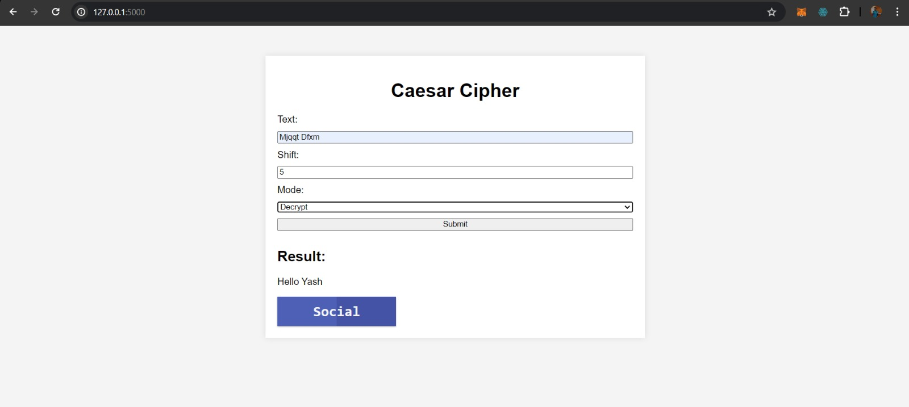

# Caesar Cipher Encryption Decryption

## Problem Statement

Create a Python program that can encrypt and decrypt text using the Caesar Cipher algorithm. Allow users to input a message and a shift value to perform encryption and decryption.

## Working of the Project

The Caesar Cipher Encryption Decryption web application provides a simple interface for users to encrypt or decrypt text using the Caesar cipher technique. Users can input their text, select a shift value, and choose to either encrypt or decrypt the text. The application then displays the resulting text based on the selected options.

### Features
- **Text Input**: Users can enter the text they want to encrypt or decrypt.
- **Shift Value**: Users can choose the shift value for the Caesar cipher.
- **Encrypt/Decrypt**: Users can select whether to encrypt or decrypt the text.
- **Result Display**: The resulting text is displayed on the interface.

### Working Img

### LinkedIn

